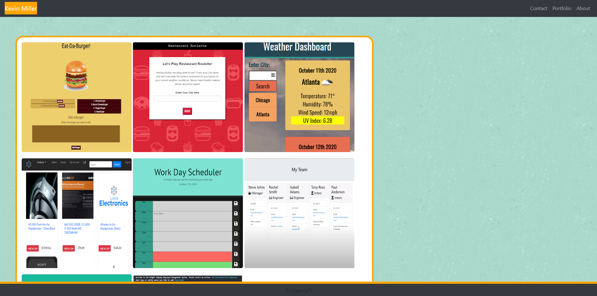

  # Kevin Miller - Portfolio

  

  ## Description
  A responsive website currently deployed on Heroku to act as a portfolio for my coding projects. This application utilizes the npm packages express, express handlebars, mysql2, 
  and sequelize. All pages are served through handlebars. The portfolio section connects to a JawsDB database where I have stored information about any repositories I am 
  displaying in my portfolio and dynamically loads them to the page.

  ## Table of Contents
  * [Installation](#installation)
  * [Usage](#usage)
  * [Contributing](#contributing)
  * [Tests](#tests)
  * [Questions](#questions)

  ## Installation 
    
  *Steps required to install package:* 
    
  All necessary dependencies are included in the package.json file. You may utilize npm i to install. 

  ## Usage

  *Examples of project use:*
  
  [Heroku-Deployed-Link](https://km-port.herokuapp.com/)
  
  

  Use to show your friends, family, or potential employers all that you've been working on!

  ## Contributing

  *If you are interested in contributing to this project, please follow the below instructions:*

  Pull requests not welcome at this time.

  ## Tests

  *Application tests and instructions for them:*

  N/A

  ## License

  MIT License
  

  ## Questions

  *If you have any questions regarding this application, please utilize the below contact information:*

  [kmiller343@gmail.com](mailto:kmiller343@gmail.com)
  
  [GitHub Profile](https://www.github.com/k1te-m)
  
